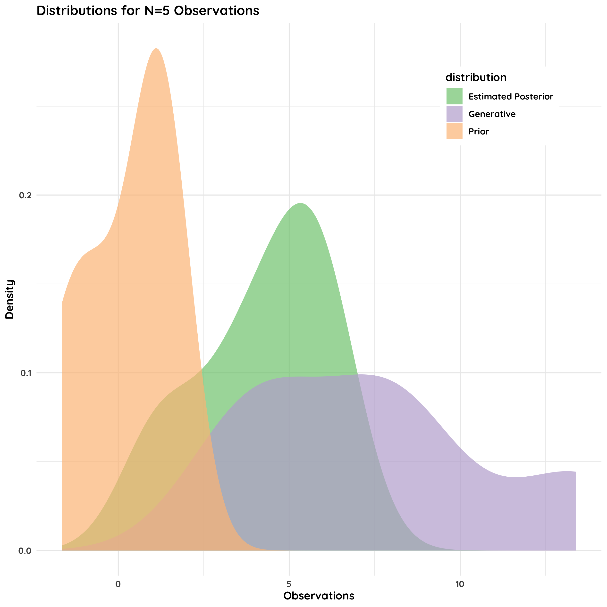
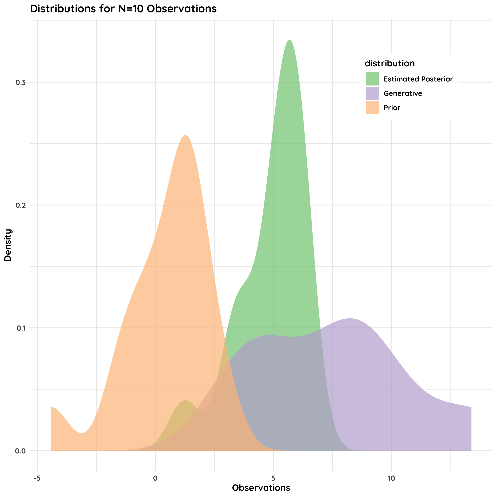
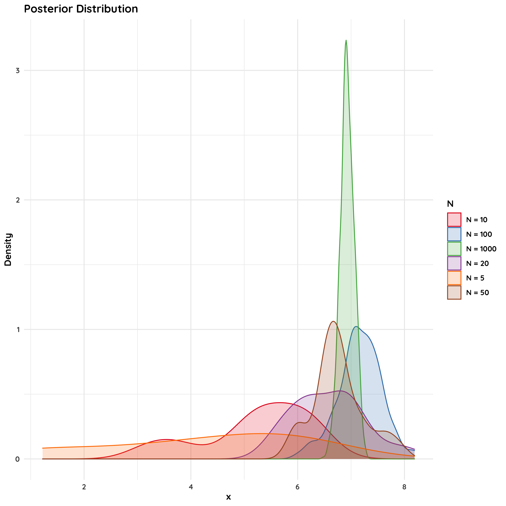
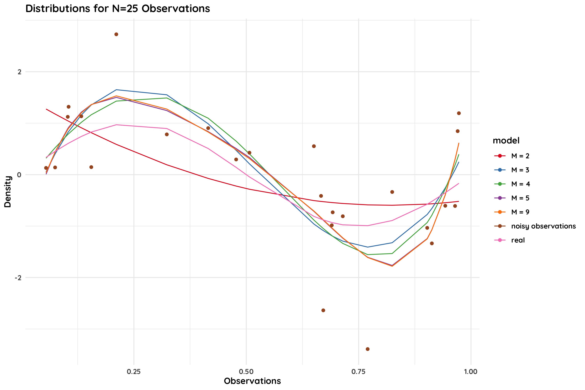
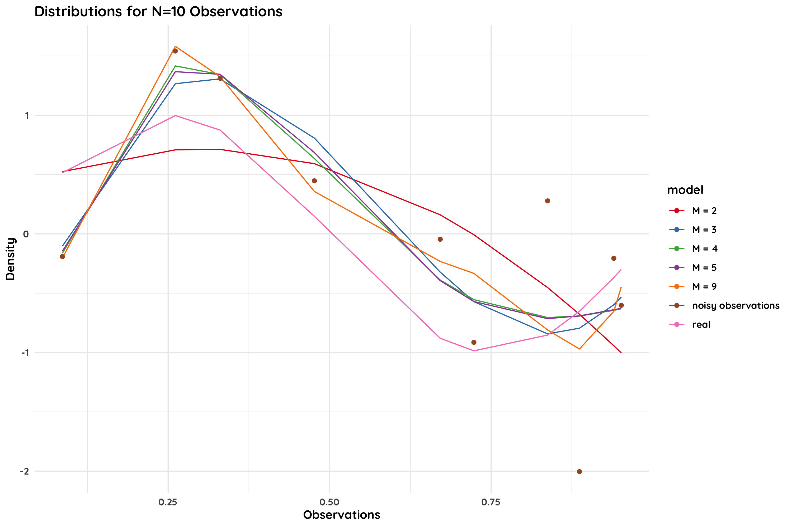
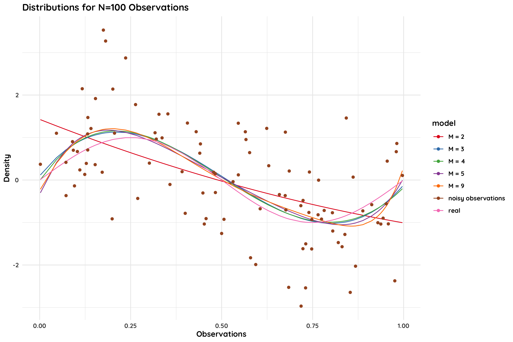
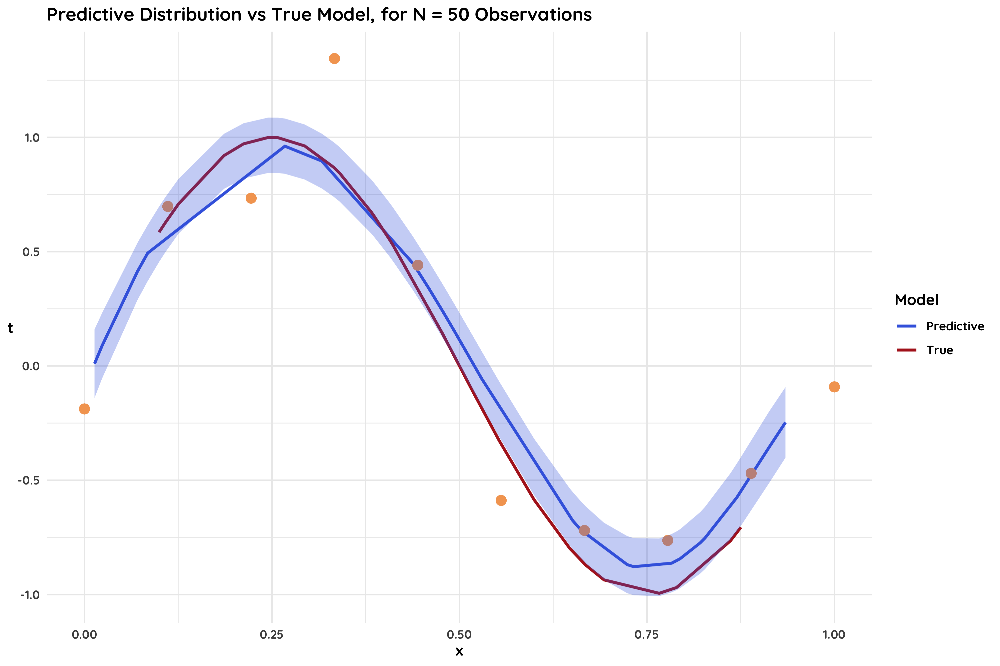
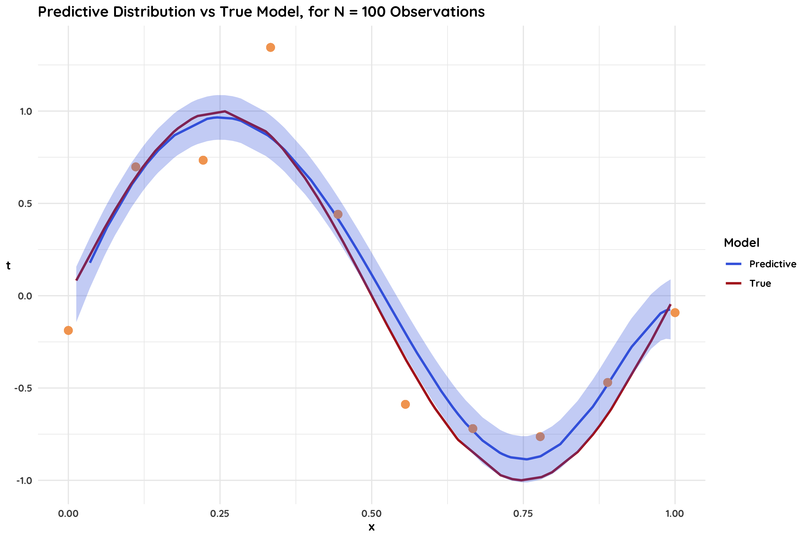
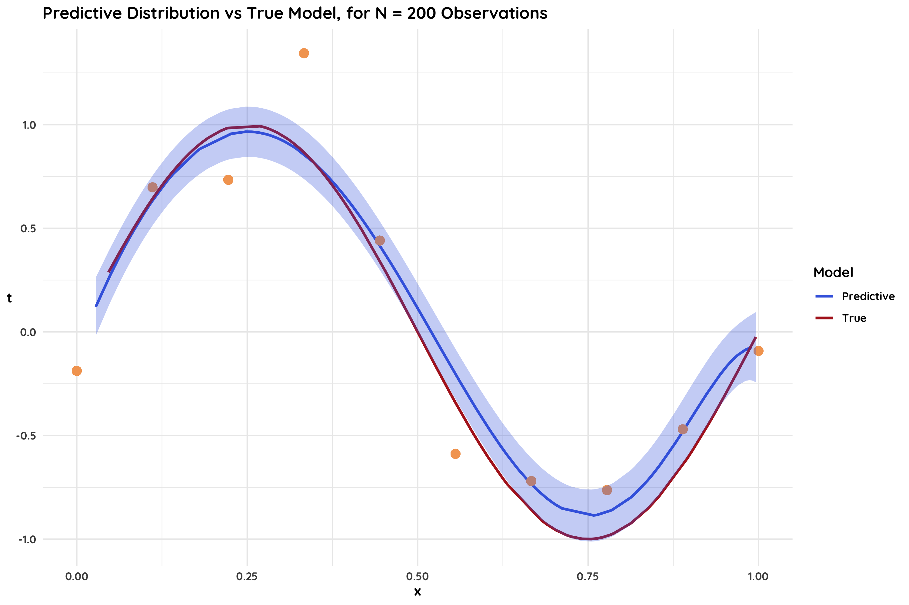
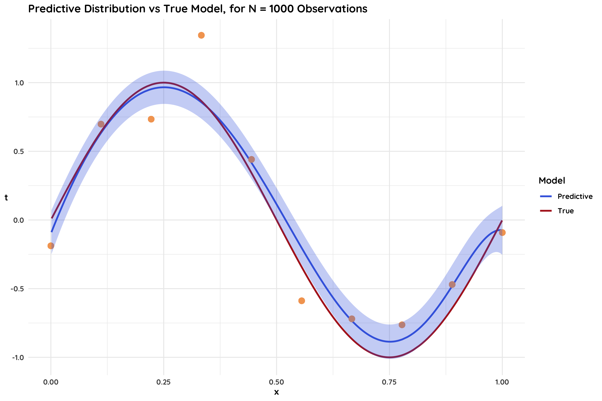

```{r setup, include=FALSE}
ReQ_packages = c("dplyr", "tidyr", "stringr", "magrittr", "data.table", "ggplot2", "RColorBrewer", 
                 "ggpubr", "rcartocolor", "DT", "MASS", "knitr", "kableExtra")

for (pack in ReQ_packages) {
  if(pack %in% rownames(installed.packages()) == FALSE) {
    BiocManager::install(pack)
    install.packages(pack)
    suppressPackageStartupMessages(library(pack, character.only = TRUE))
  } else {
    suppressPackageStartupMessages(library(pack, character.only = TRUE))
  }
}

knitr::opts_chunk$set(echo = FALSE, warning = FALSE)
options(knitr.table.format = "html")
```

# P1. Posterior Probability Distribution


> **Task**: Consider now that x is distributed as x\~Ν(μ,16); we believe that the prior for the mean is μ\~Ν(0,4). Use the distribution Ν(7,16) to generate observations for x.

> 1.  Develop an algorithm that estimates the posterior distribution's mean and variance, assuming we have available N= 1, 5, 10, 20, 50, 100 and 1000 observations, respectively.
> 2.  For every N, provide a diagram that shows the prior distribution, the distribution generating the data, and the estimated posterior distribution.

**Implementation:**

The algorithm implemented is fairly straightforward, and utilizes the formulas for the mean and variance that were proven above for the posterior distribution.


```{r}
obs <- data.frame(N = c(1, 5, 10, 20, 50, 100, 1000))
varian = 16
mu_0 = 0
varian_0 = 4

plt.df <- data.frame(N = NA, distribution = NA, observations = NA) # initializing
for (i in 1:dim(obs)[1]) {
  set.seed(1)
  
  # Generating observations, with x~Ν(7,16)
  x <- rnorm(obs$N[i], mean = 7, sd = sqrt(16))
  
  # Mean of the posterior distribution
  mu_N = (obs$N[i] * varian_0 * mean(x) + varian * mu_0) / (obs$N[i] * varian_0 + varian)
  # Variance of the posterior distribution
  sigma_N = (varian * varian_0) / (obs$N[i] * varian_0 + varian)
  
  obs$mean[i] <- mu_N
  obs$variance[i] <- sigma_N
  
  # Plotting Matrix
  plt.df <- rbind(plt.df, data.frame(N = rep(obs$N[i], obs$N[i]),
                                     distribution = factor(rep(c("Prior", "Generative", "Estimated Posterior"), each=obs$N[i])),
                                     observations = c(rnorm(obs$N[i], mean = mu_0, sd = sqrt(varian_0)), # prior
                                                      x, # generative
                                                      rnorm(obs$N[i], mean=mu_N, sd = sqrt(sigma_N))))) # estimated
  
  plt.df <- na.omit(plt.df)
  
  # Plotting Density
  if (i > 1) { # N=1 is omitted, since we cannot abtain a desnity plot with 1 point
    
    name <- paste0("../out/P1.Distribution.N", obs$N[i], ".png")
    col_pal <- brewer.pal("Accent", n = 3)
    
    png(name, height = 2500, width = 2500, res = 300)
    print({
      ggplot(plt.df[plt.df$N >= 5 ,], aes(x = observations, color = distribution, fill = distribution)) +
        geom_density(alpha=0.7, linetype = "blank") +
        scale_color_manual(values = col_pal) +
        scale_fill_manual(values = col_pal) +
        ggtitle(paste0("Distributions for N=", obs$N[i], " Observations")) +
        xlab("Observations") +
        ylab("Density") +
        theme_minimal(base_family = "Quicksand") +
        theme(axis.text = element_text(face = "bold"),
              axis.title = element_text(face = "bold"),
              title = element_text(face = "bold"),
              legend.title = element_text(face = "bold"),
              legend.text = element_text(face = "bold")) +
        theme(legend.position = c(0.82, 0.85), legend.background = element_rect(fill="white", linetype="blank"))
    })  
    dev.off()
    
    
  }
}

plt.df2 <- plt.df %>% dplyr::filter(distribution == "Estimated Posterior") %>%
  dplyr::select(-distribution) %>%
  dplyr::filter(N > 1) %>%
  dplyr::mutate(N = str_c("N = ", N))

name <- "../out/P1.PosteriorDistribution.png"
col_pal <- brewer.pal("Set1", n=8)[c(1:5,7:8)]
    
png(name, height = 2500, width = 2500, res = 300)
ggplot(plt.df2, aes(x=observations, color = N, fill = N)) +
  geom_density(alpha = 0.2) +
  scale_color_manual(values = col_pal) +
  scale_fill_manual(values = col_pal) +
  ggtitle(paste0("Posterior Distribution")) +
        xlab("x") +
        ylab("Density") +
        theme_minimal(base_family = "Quicksand") +
        theme(axis.text = element_text(face = "bold"),
              axis.title = element_text(face = "bold"),
              title = element_text(face = "bold"),
              legend.title = element_text(face = "bold"),
              legend.text = element_text(face = "bold")) +
        theme(legend.position = "right", legend.background = element_rect(fill="white", linetype="blank"))
dev.off()

```

Running the algorithm provides the following insightful graphs:







# P2. Polynomial Curve Fitting

> Task: Draw a period of the sinusoidal function y(x)=sin(2πx) and select N samples for x uniformly distributed in the interval [0,1]. To every y(x) value add Gaussian noise distributed as Ν(0,1) to generate a set of observations.

> -   Fit to the noisy observations a polynomial (in the data) model of degree M=2,3,4,5 or 9 and provide a table with the coefficients of the best least-squares fit model and the achieved RMSE. 
> -   Provide a plot showing the function y(x), the observations drawn, and the best fit model for every different value of M.
> -   Repeat the above procedure for N=10 and N=100.

**Implementation:**

The algorithm was implemented for 3 different values of N: 25, 10, and 100, and for models with degrees M=2,3,4,5 and 9. The coefficients of the polynomial model were estimated via the Least Squares method.

```{r}
pol.model <- function(x, M) {
  x.pol <- matrix(ncol = M+1, nrow = n.temp)
  for (i in 0:M) {
    x.pol[,i+1] <- x^i
  }
  return(x.pol)
}

N <- c(25, 10, 100)
M <- c(2,3,4,5,9)

for (i in 1:length(N)) {
  n.temp <- N[i]
  theta.all <- data.frame(Weights = paste0("w", 0:9))

  # Generating the training set - Uniform distribution
  x.train <- runif(n.temp, min = 0, max = 1)
  # Generating noise
  noise.train <- rnorm(n.temp, mean = 0, sd = sqrt(1))
  y.real <- sin(2*pi*x.train)
  y.train <- y.real + noise.train

  for (m in M) {
    assign(paste("x.pol.", m, sep=""), pol.model(x.train, m))
    x.pol.tmp <- get(paste0("x.pol.", m))
    
    assign(paste("theta.", m, sep=""), (ginv(t(x.pol.tmp) %*% x.pol.tmp) %*% t(x.pol.tmp)) %*% y.train)
    theta.tmp <- get(paste0("theta.", m))
    colnames(theta.tmp) <- paste0("M", m)
    theta.all <- merge(theta.all, data.frame(Weights = paste0("w", 0:m), theta.tmp), all = TRUE)
        
    y.pred.tmp <- x.pol.tmp %*% theta.tmp
    colnames(y.pred.tmp) <- "y.val"
    assign(paste("y.pred.", m, sep=""), y.pred.tmp)
    
    assign(paste("RMSE.model.", m, sep=""), sqrt( (1 / n.temp) * sum( (y.pred.tmp - y.real)^2 ) ))
    
  }
  
  assign(paste0("theta.", n.temp), theta.all)
      
  # plot matrix
  plot.df <- data.frame(model = "real", x.val = x.train, y.val = y.real)
  plot.df <- rbind(plot.df, data.frame(model = "noisy observations", x.val = x.train, y.val = y.train))
  for (m in M) {
    plot.df <- rbind(plot.df, data.frame(model = paste0("M = ", m), x.val = x.train, y.val = get(paste0("y.pred.", m)) ))
  }  
  
  # plotting
  col_pal <- brewer.pal("Set1", n=8)[c(1:5,7:8)]
  name <- paste0("../out/P2.LeastSquares.N", n.temp, ".png")
  png(name, width = 3000, height = 2000, res = 300)
  
  print({
    ggplot(plot.df, aes(x = x.val, y = y.val, color = model)) +
      geom_line(data = plot.df[plot.df$model != "noisy observations", ]) + 
      geom_point(data = plot.df[plot.df$model == "noisy observations", ]) +
      ggtitle(paste0("Distributions for N=", n.temp, " Observations")) +
      scale_color_manual(values = col_pal) +
      xlab("Observations") +
      ylab("Density") +
      theme_minimal(base_family = "Quicksand") +
      theme(axis.text = element_text(face = "bold"),
            axis.title = element_text(face = "bold"),
            title = element_text(face = "bold"),
            legend.title = element_text(face = "bold"),
            legend.text = element_text(face = "bold")) +
      theme(legend.position = "right", legend.background = element_rect(fill="white", linetype="blank"))
  })
  dev.off()

}

```

## N = 25

```{r echo=FALSE, results='asis'}
cat("**Weights for N=25**")
kable(theta.25, format = "html")
cat("\n")
```



## N = 10

```{r echo=FALSE, results='asis'}
cat("**Weights for N=10**")
kable(theta.10, format = "html")
cat("\n")
```



## N = 100

```{r echo=FALSE, results='asis'}
cat("**Weights for N=100**")
kable(theta.100, format = "html")
cat("\n")
```




# P3. Predictive Bayesian

> Task: For the same setup as in Problem 4 above, let's assume that the observations are generated as t = y(x) + η, where y(x)=sin(2πx) and the Gaussian noise η is distributed by Ν(0, β-1) with β=11.1. You are given a dataset generated in this way with Ν=10 samples **(x,t)** where 0\<x\<1. Assume that you want to fit to the data a regression model of the form t = g(x,**w**) + η, where g(x,**w**) is an M=9 degree polynomial with coefficients vector **w** following a Normal prior distribution with precision α=0.005 (Bayes approach).

> Construct the predictive model which allows for every unseen x (not in the training set) to produce a prediction t. Plot the mean m(x) and variance s2(x) of the predictive Gaussian model for many different values of x in the interval 0\<x\<1. What do you observe? Discuss your findings.

**Implementation:**

In order to fully incorporate the Bayesian approach for this task, the following formulas were taken into account:

-   For the variance matrix S of the posterior distribution over the coefficients: ${{\bf\mathcal{S}}_N^{-1} = a{\bf I} + \beta{\bf\Phi}^T{\bf\Phi}}$
-   For the mean of the posterior distribution over the coefficients: ${{\bf{m_N} = \beta{\bf\mathcal{S}}_N}{\bf\Phi}^T{\bf t}}$
-   For the variance of the predictive distribution, for a point x from the test set: ${\sigma_N^2(x) = \frac{1}{\beta} + \phi(x)^T{\bf\mathcal{S}}_N \phi(x)}$
-   for the mean of the predictive distribution, for a point x from the test set: ${\mu = {\bf m}_N^T \phi(x)}$

The four equations were incorporated in a single function, `bayes.predict` that computes the predictive distribution. The approach was tested for various numbers of observations, N=10, 50, 100, 200, 1000.

```{r}
set.seed(1)
N <- c(10, 50, 100, 200, 1000)
M <- 9
alph <- 0.005
beta <- 11.1

x.train <- seq(0,1, length.out = 10)
noise.train <- rnorm(N[1], mean = 0, sd = sqrt(beta^(-1)))
y.real <- sin(2*pi*x.train)
y.train <- y.real + noise.train

# Design Matrix Phi
reg.pol.train <- matrix(ncol = M+1, nrow = N[1])
for (i in 0:M) { reg.pol.train[,i+1] <- x.train^i }

# phi vector
reg.pol <- function(x, M) {
  x.pol <- vector(length = M+1)
  for (i in 0:M) {
    x.pol[i+1] <- x^i
  } 
  return(x.pol)
}

# Defining the Predictive Distribution Function
bayes.predict <- function(regression_test, deg) {
  # Matrix S
  bayes.sigma <- ginv( alph * diag(deg+1) + beta * t(reg.pol.train) %*% reg.pol.train )
  # Variance of predictive distribution
  bayes.var <- beta^(-1) + t(regression_test) %*% bayes.sigma %*% regression_test
  
  # Mean of posterior distribution
  bayes.mu <- beta * bayes.sigma %*% t(reg.pol.train) %*% y.train 
  # Mean of predictive distribution
  bayes.pred <- t(bayes.mu) %*% regression_test
  
  return(list(bayes.pred, bayes.var))
}


for (i in 2:5) {
  n.temp <- N[i]
  x.test <- runif(n.temp, min = 0, max = 1)
  pred.mean <- vector(length = n.temp)
  pred.var <- vector(length = n.temp)
  
  # Calculating the mean and variance per 
  for (i in 1:length(x.test)) {
    phi.test <- reg.pol(x.test[i], M)
    pred <- bayes.predict(phi.test, M)
    pred.mean[i] <- pred[1]
    pred.var[i] <- pred[2]
  }
  
  # Auxiliary Plotting Data Frame
  plot.df <- data.frame(model = "Predictive", N = rep(N[1], N[1]), x.val = x.test, 
                        y.val = unlist(pred.mean), variance = unlist(pred.var))
  plot.df <- rbind(plot.df, data.frame(model = "True", N = rep(n.temp, n.temp), x.val = x.test, 
                        y.val = sin(2*pi*x.test), variance = NA))
  plot.df <- rbind(plot.df, data.frame(model = "Noisy Observations", N = rep(n.temp, n.temp), x.val = x.train, 
                        y.val = y.train, variance = NA))
  
  # Plotting
  col_pal <- c("royalblue", "firebrick", "sandybrown")
  
  name <- paste0("../out/P3.PredictiveBayesian.N", n.temp, ".png")
  png(name, width = 3000, height = 2000, res = 300)
  
  print({
    plt <- ggplot(plot.df, aes(x=x.val, y=y.val)) +
      geom_line(data = plot.df[plot.df$model == c("Predictive", "True"), ], aes(color = model), size = 1) + 
      geom_point(data = plot.df[plot.df$model == "Noisy Observations", ], aes(color = model), color = col_pal[3], size = 3) +
      scale_color_manual("Model", values = col_pal) +
      geom_ribbon(data = plot.df[plot.df$model == "Predictive", ], fill = col_pal[1],
                  aes(ymin = y.val - variance, ymax = y.val + variance), alpha = 0.3) + 
      scale_fill_manual(values = "#7FC97F") +
      ggtitle(paste0("Predictive Distribution vs True Model, for N = ", n.temp, " Observations")) +
      xlab("x") +
      ylab("t") +
      theme_minimal(base_family = "Quicksand") +
      theme(axis.text = element_text(face = "bold"),
            axis.title = element_text(face = "bold"),
            title = element_text(face = "bold"),
            legend.title = element_text(face = "bold"),
            legend.text = element_text(face = "bold"),
            axis.title.y = element_text(angle = 0, vjust = 0.5)) +
      labs(fill = "Variance") + 
      labs(color = "Model") +
      theme(legend.position = "right", legend.background = element_rect(fill="white", linetype="blank"))
  })
  dev.off()
}

```






